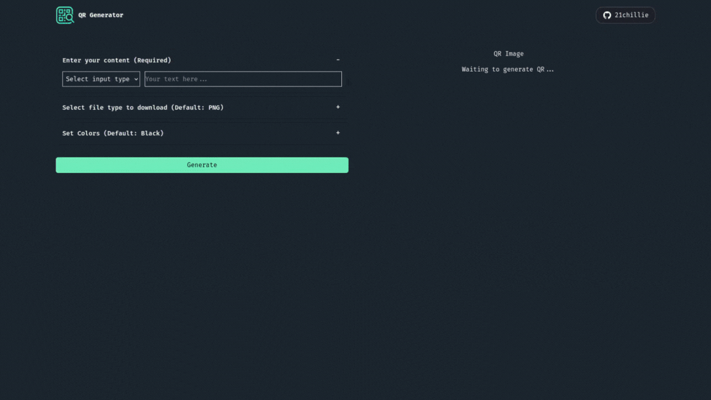

# QR Code Generator

A simple QR code generator web application built with Node.js, Express, Axios, and EJS templating.

## Demo



## Features

- Dynamic input types: URL, Text, or Email.
- Choose file type: PNG, JPG, JPEG or SVG.
- Pick custom color for the QR code.

## Prerequisites

Make sure you have the following installed on your system:

- [Node.js](https://nodejs.org/)
- npm (comes bundled with Node.js)

You can check your versions by running:

```bash
node -v
npm -v
```

## Folder Structure

```
├── public/          # Static assets (CSS, JS, images, fonts)
├── views/           # EJS templates
├── app.js           # Express server entry point
├── package.json     # Project metadata and dependencies
└── README.md
```

## How To Run Locally

and then clone the project:

```bash
https://github.com/21Chillie/QR-Code-Generator.git
```

```bash
cd qr-code-generator
```

After that install all dependencies and Build:

```bash
npm install
```

```bash
npm run build
```

Start the development server:

```bash
npm start
```

Then open your browser and go to:

```bash
http://localhost:3000
```

## License

This project is open-source and available under the MIT License.
